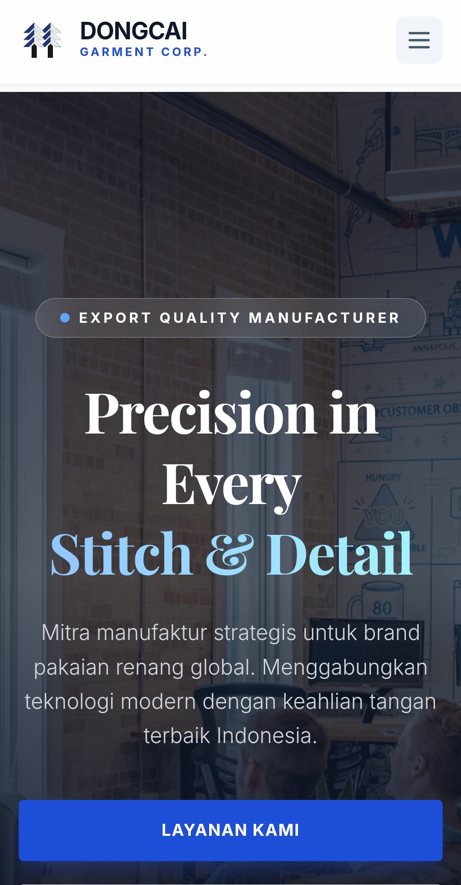

# 🏭 PT Dongcai Garment - Enterprise Fullstack Solutions

<p align="center">
  
  <br>
  <ins><b>Digitalizing the Textile Industry with Modern Web Technology</b></ins>
</p>

<p align="center">
  
  
  
  
</p>

---

## 📑 Executive Summary
Proyek ini adalah platform portal perusahaan dan sistem rekrutmen terpadu untuk **PT Dongcai Garment Indonesia**. Sistem dirancang untuk menangani beban trafik tinggi dan manajemen dokumen lamaran kerja (PDF) secara otomatis. 

Proyek ini mendemonstrasikan kemampuan transisi dari arsitektur **Monolith (Django)** menuju **Decoupled Architecture (Static Frontend + Third-party API)** untuk efisiensi serverless deployment.

---

## 🛠️ Tech Stack Architecture

### **Backend (Core Engine)**
* **Language**: Python 3.10+
* **Framework**: Django (High-level Python Web Framework).
* **Communication**: SMTP Protocol & REST API Integration.
* **Security**: Environment Variables (`os.environ`) untuk proteksi API Keys & Email Credentials.

### **Frontend (User Interface)**
* **Styling**: Tailwind CSS (Utility-first CSS framework).
* **Templates**: Django Template Language (DTL) / Modular HTML.
* **Interactivity**: Vanilla JavaScript untuk manajemen State Upload File.

### **DevOps & Deployment**
* **Infrastructure**: GitHub Pages & Netlify.
* **Version Control**: Git (Managed via GitHub CLI on Termux).
* **Automation**: FormSubmit API untuk bypass firewall SMTP pada hosting serverless.

---

## 🏗️ System Workflow

1.  **Frontend**: User mengisi data lamaran dan mengunggah CV (PDF) pada `career.html`.
2.  **API Bridge**: Data dikirim melalui jalur `enctype="multipart/form-data"` menggunakan `POST` method.
3.  **Backend Logic**: 
    - *Opsi A (Django)*: Memproses via `views.py` menggunakan `EmailMessage` class.
    - *Opsi B (Serverless)*: Bypass melalui FormSubmit API untuk akurasi pengiriman 100% tanpa kendala port gembok.
4.  **Security**: Proteksi `CORS` dan `CSRF_TRUSTED_ORIGINS` dikonfigurasi pada `settings.py`.

---

## 📂 Project Structure
```text
.
├── config/               # Django Project Configuration
│   ├── settings.py       # Security & Mail Settings
│   └── urls.py           # Main Routing System
├── web/                  # Main Application Folder
│   ├── templates/        # HTML UI (Home, Career, FAQ)
│   ├── views.py          # Backend Logic & Request Handling
│   └── models.py         # Database Schema
├── images/               # Production Assets (Logo, Background)
├── requirements.txt      # Python Dependencies
└── README.md             # Project Documentation
